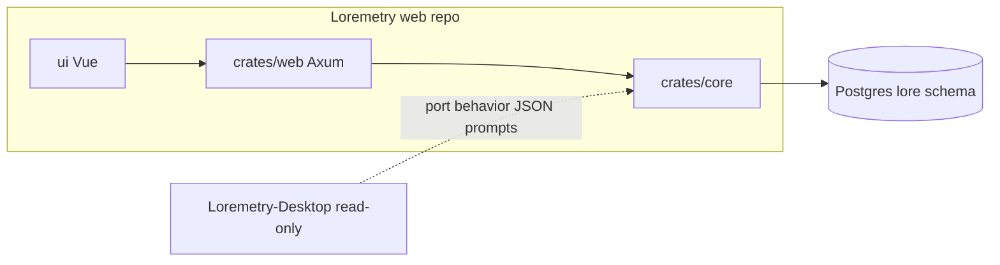

# Loremetry Web — Agent Continuation Brief

Read this file first when starting work in the **Loremetry web repo** (`/Users/norris/Developer/Loremetry`, GitHub `dnorris-works/Loremetry`). Desktop lives in sibling **`Loremetry-Desktop`** — read-only reference; hibernate unless explicitly asked to extend it. There are **no users** and **no migration** requirements.

---

## Mission

Build and extend the **web application** that replaces the desktop Tauri app. The web app is **totally distinct** from desktop — **no shared code, crates, or npm packages** with desktop. Use `Loremetry-Desktop/` only as a **reference** for behavior, report catalog, UI layout, and seed JSON when porting features.

**Rust owns behavior; Vue owns presentation.** API/worker = behavior; Vue = UI only.

---

## Workspace & repos

| Item | Location |
|------|----------|
| **Web (this workspace)** | `/Users/norris/Developer/Loremetry` — `crates/core`, `crates/web`, `ui/` |
| **Desktop (hibernating)** | `/Users/norris/Developer/Loremetry-Desktop` |
| **Rust workspace** | `crates/core` (`loremetry-core`), `crates/web` (`loremetry-web`) |
| **Frontend** | `ui/` — Vue 3 + Vite |
| **Legacy (ignore)** | `src-tauri/` in this repo — excluded from Cargo workspace; do not add |
| **Deploy** | Root `Dockerfile` → single `loremetry-web` binary + baked `ui/dist`; Miget via `app.json` |
| **Branch** | Work on **`main`** (web-only). Never merge `origin/desktop` into `main`. |

`loremetry-core` is a **web-only** internal crate in this repo — not shared with desktop.



---

## Locked-in decisions

### Stack

| Layer | Choice |
|-------|--------|
| Frontend | Vue 3 + Vite (match desktop UX where useful) |
| Backend | Rust — Axum (`crates/web`) |
| Core | `loremetry-core` — analysis, DB, market intel |
| Database | **Postgres** (`lore` schema, sqlx migrations in `crates/core/migrations/`) |
| Auth | **Clerk** (JWT) + **operator bypass** token (Admin) |
| Secrets | `lore.platform_secrets`, per-user secrets; `SECRETS_ENCRYPTION_KEY` in production |
| Deploy | **Docker** on **Miget** host |
| LLM provider | **TokenMix** (`api.tokenmix.ai`) — same as desktop |
| Progress | **SSE** (`GET /api/events`) — WebSocket optional later |

Local dev, Miget deploy, Clerk setup, env vars, and troubleshooting → **[README.md](README.md)**.

### Content model (no folders in DB)

**Policy:** No filesystem folders on the server. Authors upload via **UI slot selectors**, not by preserving folder layout.

#### Current (`lore.manuscripts`)

| Field | Values / notes |
|-------|----------------|
| `kind` | `chapter`, `bible`, `character`, `location` (slot-like; `chapter` = manuscript) |
| Identity | `(story_id, path_hint)` implicit |
| Ordering | `ORDER BY path_hint, title` |
| Upload | MD via `kind` query param (`crates/web/src/upload.rs`); synthetic `path_hint` e.g. `Bible/…` |
| Hash / merge | No `content_hash`; no merge-only re-upload |
| DOCX | Not implemented |

#### Target (`story_assets` migration)

| Field | Values / notes |
|-------|----------------|
| `slot` | `manuscript`, `bible`, `character`, `location` |
| Identity | `(story_id, slot, filename)` — case-insensitive |
| Ordering | `sort_order` and/or natural sort on filename |
| `content_hash` | Merge-only re-upload — update if hash changed |
| `source_format` | `md` \| `docx` — DOCX converted at ingest; analysis never reads DOCX |

```text
id, story_id, slot, title, filename, sort_order,
content (canonical markdown), content_hash, source_format (md|docx),
created_at, updated_at
```

Generated **reports** stay separate (`lore.story_documents`, `lore.saved_reports`): `story_id`, `doc_type`, `content`, `generated_at`, manuscript fingerprint for staleness.

### Upload rules (policy — not all implemented)

| Rule | Behavior |
|------|----------|
| Allowed formats | `.md`, `.docx` only |
| DOCX | Convert to markdown at ingest (e.g. pandoc in worker); analysis never reads DOCX |
| Other formats | Do not import; collect errors in an **import report** (per-file messages) |
| Re-upload | **Merge changed files only** — match `(story_id, slot, filename)`; update if hash changed |
| Files not in upload | **Do not delete** existing assets (merge-only unless user explicitly removes in UI) |
| Path case | **Case-insensitive** matching; preserve display casing from first upload or defaults |
| Slot assignment | User selects slot in UI before/during upload — **not** inferred from zip paths |

Optional: bulk zip upload where user assigns slot per batch, or zip includes `manifest.json` for auto-slot assignment on re-import.

### Download rules (policy — not implemented)

Export as **zip** with **synthetic folder layout** (folders only in the zip, not in DB):

```text
Manuscript/
Bible/
Characters/
Locations/
Reports/
manifest.json   # optional: [{ "filename", "slot", "sort_order" }] for round-trip
```

Round-trip: web edit → download zip → edit locally → re-upload with slots (or manifest).

### Pricing & AI

- **No hardcoded model prices.** Prices only from TokenMix catalog fetch (`input_price` + `output_price` required to select a model).
- Show `pricing unavailable` when missing — same policy as desktop hardening.
- No Claude/`provider-models.json` pricing fallbacks.
- API keys: per-user in Postgres (encrypted at rest); platform keys in `lore.platform_secrets`; server-side for workers.

### Analysis

- Port pipelines from **`Loremetry-Desktop/`** as needed (`src-tauri/src/analysis/`, `prompts.rs`, `llm.rs`).
- Long jobs (`analyze`, craft pipeline) → **background worker** (target); today `analyze_story` runs in the API process (`crates/web/src/routes.rs`).
- Progress: SSE (current); replaces desktop Tauri events (`genre:log`, `summary:chapter-progress`).
- Staleness: when manuscript `content_hash` changes, mark dependent reports stale (desktop `report_freshness` / `check_analysis_state`).
- Business thresholds in `lookup-config.json`, not hardcoded in Rust.

---

## Desktop vs Web parity gap

The web app has real backend work (KDP/Wide pipeline, auth, Postgres) but **desktop still leads on reports, layout, and product surface**. Port from `Loremetry-Desktop/`; do not assume web already has these.

### UI layout & app modes

| Area | Desktop | Web (`ui/`) |
|------|---------|-------------|
| App modes | Analyzer, Writing, **Marketing** | Analyzer, Writing — no Marketing |
| Shell | `App.vue` grid + resizable sidebar + status footer (AI spend) | `MainApp.vue` — simpler; no spend footer |
| Analyzer tabs | **KDP/Wide \| Craft \| Publish \| Saved** | **Done** — `AnalyzerPlatformTabs.vue` |
| Saved reports | `SavedReportsPanel.vue` | **Done** — `SavedReportsPanel.vue` |
| Settings | **9-tab** `SettingsPanel.vue` | `AdminPanel.vue` (operator: secrets, SQL) only |
| Help | `HelpPanel.vue` + `src/help/reports.md` | Missing |
| Craft UI grouping | `useCraftReportGroups.ts` + `craft-report-groups.json` | **Done** — grouped `AnalyzerPanel.vue` |
| Marketing | Campaigns, creatives, platform accounts | Missing entirely |
| Manuscript editor | `ManuscriptViewer.vue` + suggest-fix | `ManuscriptViewer.vue` exists — verify parity |
| Cost badges | `reportCostPricing.ts` | `lib/estimateCosts.ts` — partial |
| Freshness badges | `check_analysis_state` UX | **Partial** — exists badges on cards; no full freshness API |

### Reports & analysis (`crates/core/src/analysis/`)

**Ported to web core:** `chapters`, `genres`, `categories`, `keywords`, `bisac`, `pipeline`, `zeigarnik`, `continuity`, `show_dont_tell`, `ai_isms`, `readability`, **`craft_audits`**, **`publish_audits` (partial)**

**Not ported (desktop only):**

| Module | Role |
|--------|------|
| `craft_prose_checks.rs` | Batched SDT + AI-isms |
| `content_advisory.rs` | Wide content & maturity advisory |
| `publish_audits.rs` (remainder) | `ai_beta_reader`, `cliffhanger_score`, `pacing_curve`, `vellum_prep` — need `batch_prompt.rs` |
| `chapter_stats.rs` | Deterministic chapter fingerprints |

**Report catalog (~40 types on desktop, partial on web):**

- **KDP/Wide visible:** `analysis`, `wide_analysis`, `mi_search_terms`, `keyword_search`, `competition_report`, `review_mining`, `author_analysis` — backend largely ported; UI thinner
- **Craft:** desktop ~22 types in 6 groups; web **generic craft audits ported** via `craft_audits.rs` + `run_craft_pipeline`
- **Publish:** 8 types on desktop — **4 ported** (`hook_strength`, `line_polish`, `blurb_builder`, `print_production`); 4 need `batch_prompt`
- **Infrastructure (hidden):** chapter_summaries, genre_analysis, etc. — partially in pipeline; no Settings → Story Data UI

**Data / UX gaps:**

- `lore.saved_reports` — saved panel wired; archived-reports settings UI missing
- Report freshness badges / `check_analysis_state` on backend `AnalysisState` — partial
- `reportRenderer.ts` — craft audit schema added; verify publish schemas for all ported types
- Series-scoped continuity + craft series reports — **wired** in craft pipeline + AnalyzerPanel

---

## Deploy

### Current

- **Single Docker image:** API + static UI (`Dockerfile` → `loremetry-web` + `ui/dist`)
- **Local Postgres:** `docker compose -f docker-compose.db.yml up -d`
- **Miget:** `app.json` (`LANGUAGE=dockerfile`); push to `main` triggers build

### Target (Miget)

```text
services:
  postgres
  api       # Axum HTTP: auth, stories, assets, reports, job enqueue
  worker    # zip ingest, docx→md, analysis pipelines
  web       # nginx or static serve: Vue production build
```

### Key environment variables

| Variable | Purpose |
|----------|---------|
| `DATABASE_URL` | PostgreSQL connection string |
| `SECRETS_ENCRYPTION_KEY` | Base64 32-byte key for encrypted secrets in DB |
| `PORT` | HTTP listen port (default `8080`) |
| `STATIC_DIR` | Path to built Vue assets |
| `MAX_BODY_MB` | Upload limit (default 256) |

Provider API keys, Clerk issuer/publishable key, bootstrap admin → **Postgres** (`lore.platform_secrets`), not host env. See README for full list and troubleshooting.

---

## Progress checklist

| Step | Status | Notes |
|------|--------|-------|
| Repo + Docker + Postgres migrations | **Done** | `crates/core/migrations/` |
| Auth + users | **Done** | Clerk + operator bypass; per-user secrets |
| Stories CRUD | **Done** | `lore.stories` |
| Asset upload (slots/kinds) | **Partial** | MD + `kind` param; no DOCX, hash merge, import report |
| Asset list / edit / delete UI | **Partial** | documents API + invoke paths |
| Zip download + manifest | **Not done** | |
| Report types metadata | **Partial** | `lore.report_types` seeded; craft groups copied |
| Analysis E2E | **Partial** | KDP/Wide + craft/publish subset in core; synchronous in API |
| Analyzer UI parity | **Mostly done** | Platform tabs, craft groups, saved panel; no help/spend footer |
| Craft reports | **Done** | `craft_audits.rs`, `craft-report-groups.json`, pipeline loops |
| Publish reports | **Done** | All 8 types + `batch_prompt.rs` |
| User settings UI | **Done** | SettingsPanel — General, AI, Canopy, DataForSEO, Story Data, Archived |
| Marketing mode | **Missing** | Desktop-only |
| Full desktop catalog parity | **Not v1 goal** | Phased port below |

Do **not** re-scaffold from zero — extend what exists.

---

## Phased port priority (backlog)

Full parity is **not** a v1 blocker. When porting, follow this order:

1. **Analyzer shell** — ~~platform tabs, craft groups, saved panel~~ **done**; freshness badges, help panel optional
2. **Craft pipeline** — ~~`craft_audits.rs`, groups, `run_craft_pipeline`~~ **done**
3. **Publish tab** — ~~finish `publish_audits.rs` (4 remaining) + renderer schemas + `batch_prompt`~~ **done**
4. **Settings (user)** — ~~AI model slots, Canopy/DataForSEO tests, story data / summary refresh, archived reports~~ **done**
5. **Content ops** — `story_assets` migration, DOCX ingest, hash-merge upload, zip round-trip
6. **Worker split** — long jobs off the API process
7. **Marketing mode** — optional later unless product asks

**Parallel track:** web-native content model (`story_assets`, DOCX, zip, worker) can proceed alongside UI/report parity.

---

## Desktop reference map (read-only)

All paths relative to **`Loremetry-Desktop/`**:

| Concern | Path |
|---------|------|
| Report catalog & deps | `src-tauri/src/db.rs` (`report_types`), `src-tauri/data/craft-report-groups.json` |
| Craft UI sections | `src/composables/useCraftReportGroups.ts`, `src-tauri/src/craft_report_groups.rs` |
| Analysis pipelines | `src-tauri/src/analysis/pipeline.rs`, `analysis/*` |
| Craft audits | `src-tauri/src/analysis/craft_audits.rs`, `craft_prose_checks.rs` |
| Publish audits | `src-tauri/src/analysis/publish_audits.rs`, `batch_prompt.rs` |
| Chapter collection | `src-tauri/src/analysis/chapters.rs` → web: query manuscript slot ordered |
| Bible context | `src-tauri/src/prompts.rs` `discover_bible()` → concat bible+character+location |
| LLM / TokenMix | `src-tauri/src/llm.rs`, `commands.rs` `fetch_tokenmix_models` |
| Cost estimation | `src/reportCostPricing.ts`, `commands.rs` `resolve_report_model_prices` |
| Thresholds | `src-tauri/data/lookup-config.json` |
| Vue layout & analyzer | `src/App.vue`, `src/components/AnalyzerPanel.vue`, `AnalyzerPlatformTabs.vue` |
| Composables | `src/composables/` (14 composables — see desktop `Sidebar.vue`, `useAnalysis.ts`) |
| Report docs | `src/help/reports.md` |
| Marketing | `src/composables/useCampaigns.ts`, `src/components/marketing/*`, `src-tauri/src/campaigns.rs` |
| Settings | `src/components/settings/SettingsPanel.vue`, `tabs/*.vue` |

### Desktop hardening (mirror on web)

- Craft report groups: single JSON source (`crates/core/data/craft-report-groups.json`)
- Folder structure defaults on desktop; web uses **slots** for author content
- Thresholds in `lookup-config.json`, not hardcoded in Rust

---

## Explicit non-goals

- Do not create shared crates or npm packages with desktop
- Do not require authors to use a specific folder structure in uploads
- Do not store manuscript files on server filesystem (Postgres text)
- Do not hardcode LLM pricing
- Do not block v1 on full report parity with desktop
- Do not extend `Loremetry-Desktop` unless explicitly asked
- Do not add `src-tauri/` to this repo

---

## Agent startup checklist

When the user says to read this file:

1. Confirm workspace is **Loremetry web repo** on **`main`** (not `Loremetry-Desktop`, not `desktop` branch)
2. Read **progress checklist** — do not re-scaffold
3. Read **parity gap** — port remaining items from `Loremetry-Desktop/`
4. For Miget: Dockerfile deploy, `DATABASE_URL`, `SECRETS_ENCRYPTION_KEY`, Clerk origins — see README troubleshooting
5. Pick work from **phased port priority** or content-ops track
